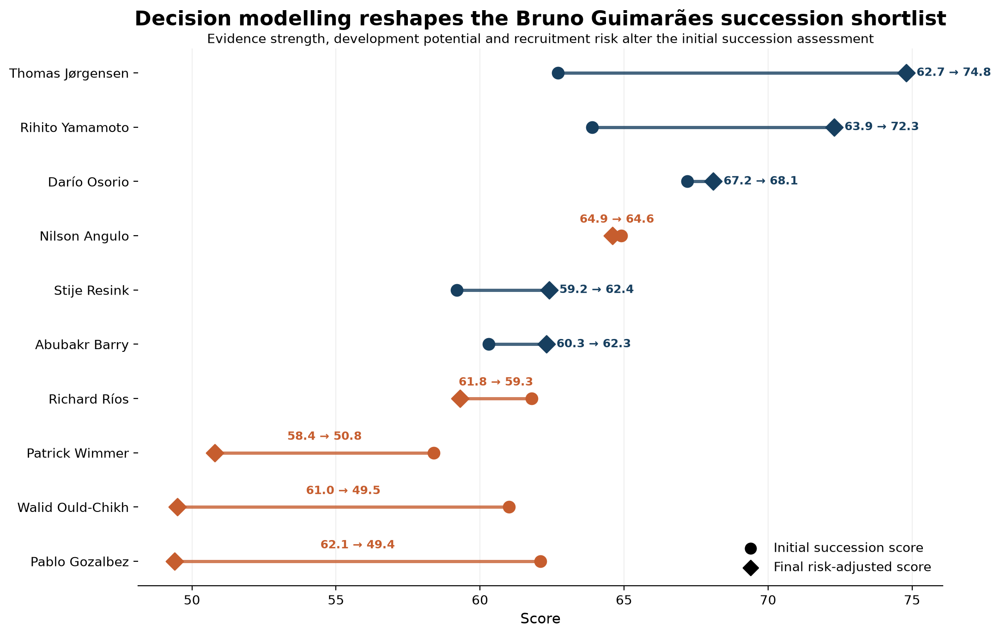
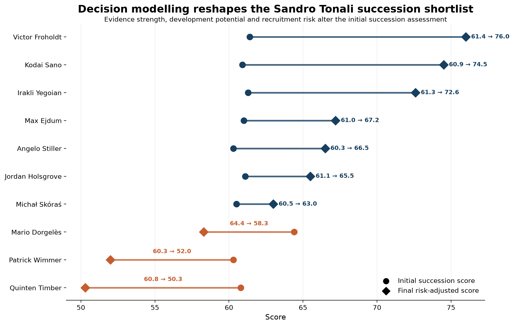

# Newcastle United Recruitment & Succession Analytics

A reproducible, Python-based decision-support framework for football recruitment and succession planning.

This project demonstrates how player-performance data can be transformed into structured recruitment decisions through statistical profiling, role-specific analysis, risk adjustment, scouting validation, and human decision governance.

The project models succession planning for three Newcastle United players:

- Anthony Gordon
- Bruno Guimarães
- Sandro Tonali

Rather than treating statistical similarity as a transfer recommendation, the framework progressively narrows candidates through role profiling, evidence assessment, development potential, recruitment risk and structured scouting validation.

> **Decision-support principle:** Analytics should narrow the search, quantify uncertainty, and improve decisions — not remove the need for football judgement.

---

## Key Results

### Anthony Gordon Succession

**Priority target:** Kristian Arnstad  
**Strong shortlist:** Tobias Bech

### Bruno Guimarães Succession

**Priority targets:** Thomas Jørgensen, Rihito Yamamoto  
**Strong shortlist:** Darío Osorio

### Sandro Tonali Succession

**Priority targets:** Victor Froholdt, Kodai Sano, Irakli Yegoian  
**Strong shortlist:** Max Ejdum

These are analytical recruitment priorities rather than final transfer recommendations. Final approval remains subject to human scouting and football-domain assessment.

---

## Succession Case Studies

### Anthony Gordon


[Read the Anthony Gordon case study](portfolio/analysis/gordon_case_study.md)

### Bruno Guimarães



[Read the Bruno Guimarães case study](portfolio/analysis/bruno_case_study.md)

### Sandro Tonali



[Read the Sandro Tonali case study](portfolio/analysis/tonali_case_study.md)

---

## What This Project Demonstrates

- Multi-league player profiling and recruitment analysis
- Role-specific candidate identification
- Risk-adjusted recruitment scoring
- Structured scouting-validation workflows
- Human-in-the-loop decision governance
- Succession planning for priority squad roles
- Reproducible QA and frozen analytical releases

---

## Decision Pipeline

```text
Player & Performance Data
          │
          ▼
Recruitment Metrics
          │
          ▼
Role / Player Profiling
          │
          ▼
Risk-Adjusted Decision Model
          │
          ▼
Executive Shortlist
          │
          ▼
Scouting Validation
          │
          ▼
Human Decision Gate
          │
          ├──────────────► Recruitment Decision
          │
          └──────────────► Succession Planning
```

---

## Project Objective

The project addresses three Newcastle United succession problems:

- Anthony Gordon
- Bruno Guimarães
- Sandro Tonali

The analytical workflow is designed to answer five progressively narrower questions:

1. Which players are statistically plausible successors?
2. Which candidates provide the strongest overall succession fit?
3. How confident should Newcastle be in the available evidence?
4. Which candidates warrant further scouting and validation?
5. Has sufficient human evidence been collected to support a final recruitment recommendation?

The result is not simply a player ranking.

It is a staged recruitment decision-support system.

---

## Analytical Architecture

```text
PLAYER DATA
    |
    v
PHASE 1
Succession Candidate Identification
    |
    v
PHASE 2
Recruitment Decision Model
    |
    +--> Succession Score
    +--> Evidence Band
    +--> Development Profile
    +--> Recruitment Risk
    +--> Decision Score
    +--> Risk-Adjusted Score
    +--> Decision Tier
    |
    v
EXECUTIVE SHORTLIST
    |
    v
PHASE 3
Scouting & Decision Validation
    |
    +--> Validation Flags
    +--> Validation Questions
    +--> Suggested Scouting Action
    |
    v
PHASE 4
Human Scouting Evidence Gate
    |
    +--> Role Fit
    +--> Tactical Fit
    +--> Evidence Review
    +--> Development Review
    +--> Video / Live Scouting
    |
    v
FINAL DECISION GATE
    |
    v
PHASE 5
Executive Reporting & Succession Briefs
```

---

## Core Design Principle

A central principle of the project is:

> **Statistical recommendation is not the same as recruitment approval.**

The analytical model is allowed to:

- identify candidates;
- rank candidates;
- quantify succession fit;
- assess evidence quality;
- flag recruitment uncertainty;
- prioritise scouting activity;
- create executive shortlists.

The analytical model is **not** allowed to produce a final recruitment approval without completed human scouting evidence.

This safeguard is implemented explicitly in Phase 4.

A candidate with incomplete scouting evidence remains:

```text
SCOUTING REQUIRED
```

and is not eligible for final approval.

---

## Phase 1 — Succession Analytics

Phase 1 establishes the underlying candidate-identification framework.

The purpose of this stage is to move from a broad player population toward players whose statistical profiles suggest potential suitability as successors to the target Newcastle players.

The output of this stage provides the analytical foundation for later decision modelling.

Phase 1 is concerned primarily with candidate discovery rather than final recruitment judgement.

---

## Phase 2 — Recruitment Decision Model

Phase 2 converts succession analysis into a structured recruitment decision framework.

Candidates are evaluated using several decision dimensions, including:

- Succession Score
- Evidence Band
- Development Profile
- Recruitment Risk
- Decision Score
- Risk-Adjusted Score
- Decision Tier

Decision tiers include:

```text
PRIORITY TARGET
STRONG SHORTLIST
SCOUT / VALIDATE
WATCHLIST
```

The executive shortlist contains only the strongest approved decision tiers:

```text
PRIORITY TARGET
STRONG SHORTLIST
```

The frozen Phase 2 executive shortlist contains nine candidates across the three succession problems.

---

## Phase 3 — Scouting & Decision Validation

Phase 3 converts analytical uncertainty into explicit scouting work.

Rather than treating uncertainty as an abstract model limitation, the system generates validation flags and associated scouting questions.

Examples include:

- evidence review;
- development projection;
- recruitment risk;
- young-player projection;
- decision uplift.

These flags determine the next recommended action for each candidate, including:

```text
TACTICAL VALIDATION
VIDEO VALIDATION
LIVE / VIDEO SCOUTING
PROGRESS TO SCOUTING
```

Phase 3 therefore acts as the bridge between statistical recruitment analysis and football scouting.

---

## Phase 4 — Human Scouting Decision Gate

Phase 4 introduces the human validation layer.

The system generates a structured scouting evidence template for every executive candidate.

The scouting framework uses a five-point scale:

```text
1 = Major concern
2 = Below required level
3 = Acceptable / neutral
4 = Strong fit
5 = Excellent fit
```

Potential scouting outcomes include:

```text
RECOMMEND
CONTINUE SCOUTING
HOLD
REJECT
```

However, a recommendation is only eligible to progress when the required human scouting evidence has been completed.

Until that evidence exists, the final decision gate remains blocked.

This prevents analytical outputs from being misrepresented as completed football recruitment decisions.

---

## Phase 5 — Executive Reporting

Phase 5 converts the preceding analytical stages into concise decision-support outputs.

### Executive Master Summary

The executive master summary combines the key information from frozen Phases 2, 3, and 4.

It provides a single view of:

- player;
- succession target;
- decision tier;
- risk-adjusted score;
- evidence strength;
- recruitment risk;
- scouting action;
- final decision state;
- executive status.

At the current project state, all nine executive candidates remain:

```text
AWAITING SCOUTING VALIDATION
```

This is intentional because no completed human scouting evidence has been entered.

### Succession Briefs

Individual executive briefs are generated for:

- Anthony Gordon succession
- Bruno Guimarães succession
- Sandro Tonali succession

Each brief ranks the shortlisted candidates and communicates:

- decision tier;
- risk-adjusted score;
- evidence strength;
- recruitment risk;
- development profile;
- required next action;
- current validation status.

---

## Validation Safeguards

The project contains several safeguards against inappropriate interpretation of analytical results.

### Evidence uncertainty

Players with weaker evidence bases can be penalised or flagged for further validation.

### Recruitment risk

Recruitment uncertainty is represented explicitly rather than being hidden inside a single ranking score.

### Human validation

Candidates cannot pass the final recruitment gate without completed scouting evidence.

### Frozen analytical phases

Completed and QA-tested phases are stored as frozen versioned artifacts.

This prevents later development work from silently changing previously validated results.

---

## Versioning & Frozen Models

Validated phases are preserved in the `frozen/` directory.

Current frozen versions include:

```text
frozen/
├── phase2_v1_0/
├── phase3_v1_0/
└── phase4_v1_0/
```

Each frozen phase contains the relevant scripts and/or outputs required to reproduce or audit that stage of the decision process.

Frozen files are write-protected after validation.

---

## Key Project Outputs

Important outputs include:

```text
data/outputs/phase2/
    recruitment_decision_board_v1_0.csv
    executive_shortlist_v1_0.csv

data/outputs/phase3/
    scouting_validation_dossiers_v1_0.csv
    scouting_action_queue_v1_0.csv

data/outputs/phase4/
    scouting_evidence_template_v1_0.csv
    validated_scouting_evidence_v1_0.csv
    final_decision_gate_v1_0.csv

data/outputs/phase5/
    executive_master_summary_v1_0.csv

data/outputs/phase5/succession_briefs/
    anthony_gordon_succession_brief_v1_0.csv
    bruno_guimaraes_succession_brief_v1_0.csv
    sandro_tonali_succession_brief_v1_0.csv
    all_succession_briefs_v1_0.csv
```

---

## Quality Assurance

Each major analytical phase contains dedicated QA checks.

These checks include:

- expected row counts;
- player consistency across outputs;
- succession-problem coverage;
- required-column validation;
- missing-value checks;
- scoring-range validation;
- approved decision categories;
- scouting-status consistency;
- final-decision safeguards.

Frozen versions are created only after the relevant phase passes QA.

---

## Reproducibility

The project is designed as a staged and auditable pipeline.

Later phases consume validated outputs from earlier frozen phases rather than silently recreating historical decisions.

This provides:

- reproducibility;
- traceability;
- version control;
- decision auditability;
- separation between modelling and human judgement.

---

## Interpretation of Results

The model should be interpreted as a recruitment decision-support framework, not as an automated transfer-selection system.

A high-ranked candidate represents a player whose available statistical evidence and modelled characteristics justify greater recruitment attention.

It does not prove that the player:

- will succeed in the Premier League;
- will adapt tactically;
- is financially attainable;
- has appropriate medical availability;
- has suitable character or personality;
- is interested in joining Newcastle United;
- will maintain historical performance;
- should automatically be signed.

Those questions require additional football, financial, medical, contractual, and human assessment.

---

## Limitations

### Statistical profile limitations

Player statistics do not fully represent tactical responsibilities, decision-making, off-ball behaviour, communication, or contextual role.

### Competition effects

Performance across leagues and teams may not translate directly to the Premier League.

### Sample-size uncertainty

Young players and players with limited minutes may have less stable statistical profiles.

### Recruitment environment

Transfer fees, wages, contract status, availability, injuries, registration rules, and player preference are not fully represented by the analytical model.

### Human scouting requirement

The project deliberately leaves final recruitment decisions unresolved until human scouting evidence is supplied.

This is a feature of the methodology rather than an incomplete analytical result.

---

## Project Status

```text
Phase 1 — Succession analytics             COMPLETE
Phase 2 — Recruitment decision model       COMPLETE / FROZEN
Phase 3 — Scouting validation              COMPLETE / FROZEN
Phase 4 — Human scouting decision gate     COMPLETE / FROZEN
Phase 5.1 — Executive master summary       COMPLETE
Phase 5.2 — Succession briefs              COMPLETE
Phase 5.3 — Project documentation          COMPLETE
```

Phase 5 integration QA is complete and the v1.0 analytical pipeline is frozen.

---

## Public Repository and Data Provenance

This repository is the public portfolio edition of the Newcastle United Recruitment & Succession Analytics project.

Original source football datasets and closely source-like processed datasets are intentionally excluded from this repository. Selected derived analytical outputs are retained to demonstrate the recruitment decision model, scouting-validation workflow, final decision gate, and succession-planning architecture.

See [DATA_PROVENANCE.md](DATA_PROVENANCE.md) for details on source-data provenance, redistribution scope, and reproduction requirements.

The analytical system is designed for decision support. Statistical outputs identify and prioritise candidates but do not independently constitute recruitment approval; final decisions require validated human scouting and football-domain assessment.
