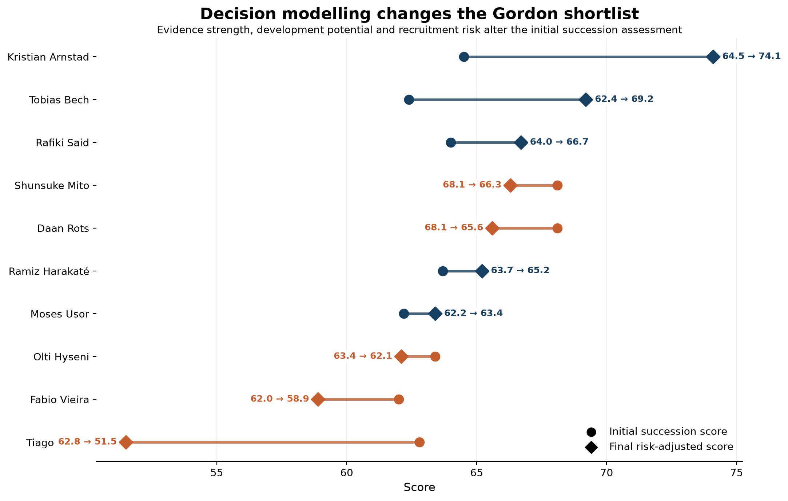

# Anthony Gordon Succession Analysis

## Question

Newcastle United's recruitment team needs to plan for the potential succession of key attacking players. For Anthony Gordon's role, the challenge is not simply to find the player with the most similar statistical profile, but to identify candidates who combine credible on-pitch suitability with sufficient evidence, development potential and manageable recruitment risk.

Which players should Newcastle prioritise for further recruitment investigation as potential successors to Anthony Gordon?

Potential successors were first screened to create a realistic comparison group, focusing on younger attacking players with sufficient playing time for meaningful analysis.

Candidates were then compared with Gordon using a role-specific statistical profile. Rather than weighting every performance metric equally, greater importance was assigned to attacking measures relevant to Gordon's role, including goals, shots, assists, shots on target and crossing.

Two components were used to assess each candidate:

* **Similarity** — how closely the player's statistical profile resembled Gordon's.
* **Role quality** — how strongly the player performed across the metrics considered important for the role.

These were combined into an initial **succession score**, weighted 60% toward similarity and 40% toward role quality.

The initial analysis produced an important distinction: the player who most closely resembled Gordon statistically was not necessarily the candidate with the strongest overall performance profile. This created the need for a second decision stage that considered whether each statistical case was supported by sufficient evidence and acceptable uncertainty.

## Initial Analysis

## Decision Analysis

The decision layer materially reshaped the initial shortlist. Candidates shown in dark blue strengthened after evidence confidence, development potential and recruitment risk were incorporated, while candidates shown in burnt orange were downgraded. The comparison demonstrates why statistical similarity alone is insufficient for recruitment decision-making: the strongest initial profile is not necessarily the strongest decision-ready option.

## Key Finding

## Recommendation

## Limitations
